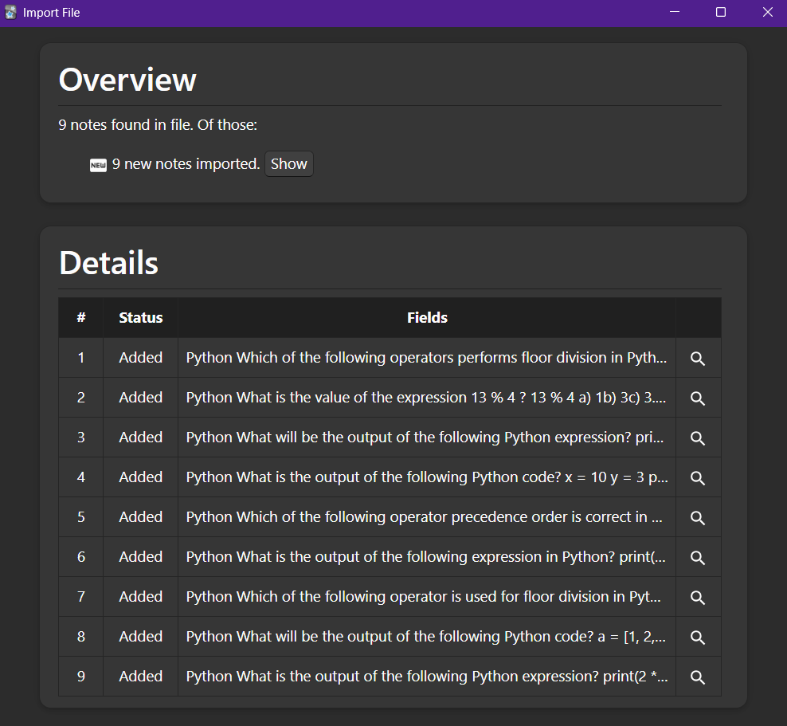
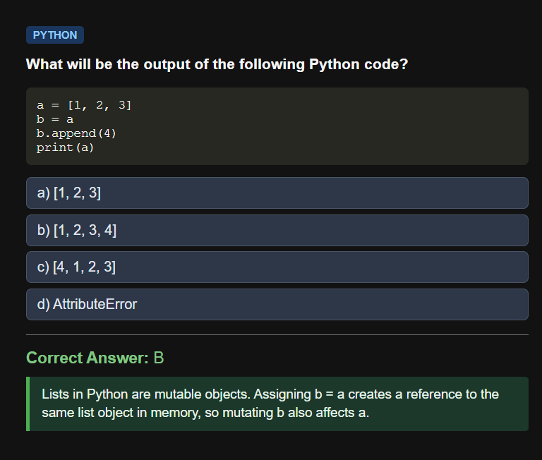

# Sanfoundry to Anki Converter

An automated pipeline designed to extract Python Multiple Choice Questions (MCQs) from raw Sanfoundry HTML pages, structure broken code snippets using a local Large Language Model (LLM via LM Studio), and format the output into an Anki-ready `.tsv` import file.

---

## Key Features

- **Automated Text Extraction**: Cleans raw HTML pages downloaded using browser extensions (e.g., SingleFile) and extracts target MCQ sections.
- **Local AI Structuring**: Uses a locally hosted LLM (e.g., Qwen2.5-Coder-7B) to fix broken Python syntax, construct valid code blocks, and output structured JSON.
- **Concurrent Processing**: Utilizes `ThreadPoolExecutor` in `02_generate_anki_cards.py` for faster batch processing across multiple requests.
- **Fail-Safe & Resume**: Maintains `processed_files.log` and uses file locking (`threading.Lock`) to safely append rows to the TSV file and avoid re-processing on script restart.
- **Custom Styling Support:** Includes card styling templates (CSS) to make reviewing questions visually clean and readable in Anki.
- **Pre-bundled Test Data:** Includes 3 complete sample HTML files and pre-generated output files for immediate testing and inspection.

---

## Pipeline Overview

```
[ HTML Files ] ──( 01_parse_html.py )──> [ Raw .txt Files ] ──( 02_generate_anki_cards.py + Local LLM )──> [ Anki TSV Output ]
```

1. **HTML Extraction (`01_parse_html.py`)**: Strips advertisements, navigation elements, headers, and footers from downloaded HTML pages, extracting the raw question sections into individual `.txt` files.
2. **AI Formatting (`02_generate_anki_cards.py`)**: Queries a local LLM running in LM Studio using multithreading to fix code indentation, parse options, isolate correct answers/explanations, and format each question into styled Anki Front/Back HTML fields.
3. **Log & Resume (`processed_files.log`)**: Tracks processed files so the batch run can be paused and resumed without duplicating effort or overwriting existing output.

---

## Included Sample Data & Output

To make exploring this project as easy as possible without needing to execute any code, **3 sample HTML test pages** along with all corresponding **pre-generated output files** are included in this repository.

* **No execution required:** Visitors do not need to set up or run the Python scripts locally just to evaluate the results.
* **Ready to test:** You can inspect the parsed output files directly or import `output/anki_import_all.tsv` straight into Anki right away to see how the conversion works.

---

## Visual Overview & Screenshots

### 1. Importing Cards into Anki
*Shows the process of adding cards into Anki via the generated output file:*



### 2. Question View & Custom CSS Styling
*How an imported MCQ appears to the user during a study session in Anki with applied styles:*



---

## Setup & Virtual Environment Installation

Follow these steps to set up the project locally within an isolated Python virtual environment.

### 1. Clone the Repository
```bash
git clone https://github.com/FLT2310/Sanfoundry_MCQ_to_Anki_Converter.git
cd Sanfoundry_MCQ_to_Anki_Converter.git
```

### 2. Create and Activate a Virtual Environment

* **On Linux / macOS:**
  ```bash
  python3 -m venv venv
  source venv/bin/activate
  ```

* **On Windows (PowerShell):**
  ```powershell
  python -m venv venv
  .\venv\Scripts\Activate.ps1
  ```

### 3. Install Dependencies
With your virtual environment active, install the required packages:

```bash
pip install beautifulsoup4 requests
```

### 4. LM Studio Setup

1. Download and install [LM Studio](https://lmstudio.ai/).
2. Download a coding-capable model such as `qwen2.5-coder-7b-instruct-q4_k_m.gguf`.
3. Start the **Local Inference Server** in LM Studio on port `1234` (`http://localhost:1234`).
4. Ensure the server API endpoints are active (OpenAI-compatible chat completions enabled).

---

## Usage Instructions

### Running the Scripts

1. Place your target Sanfoundry HTML files in the `data/html_files/` directory (or use the provided `Mock_1.html`, `Mock_2.html`, `Mock_3.html` files).
2. Run the HTML parser script to extract raw text data:

```bash
python 01_parse_html.py
```

3. Run the generator script to assemble the final Anki import file:

```bash
python 02_generate_anki_cards.py
```

### Importing into Anki

1. Open Anki and click **File > Import...**
2. Choose `output/anki_import_all.tsv`.
3. Ensure the fields match your desired Note Type (Question, Options, Answer, Explanation).
4. *(Optional)* Copy the custom CSS provided in `styles/card_style.css` into your Anki Deck's **Styling** section to apply custom typography and layout formatting.

---

## Project Structure

```text
.
├── data/
│   ├── html_files/
│   │   ├── Mock_1.html
│   │   ├── Mock_2.html
│   │   └── Mock_3.html
│   └── txt_files/
│       ├── Mock_1.txt
│       ├── Mock_2.txt
│       └── Mock_3.txt
├── output/
│   ├── anki_import_all.tsv
│   └── processed_files.log
├── screenshots/
│   ├── Screenshot_1.png
│   └── Screenshot_2.png
├── styles/
│   └── card_style.css
├── 01_parse_html.py
├── 02_generate_anki_cards.py
└── README.md
```

---

## License

This project is licensed under the MIT License - see the [LICENSE](LICENSE) file for details.